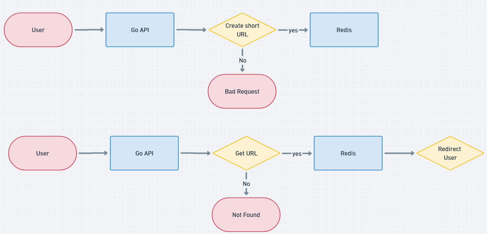

# URL Shortener

Service that allows you to shorten long URLs to make them more compact and easier to share

Challenge from [backend brasil](https://github.com/backend-br/desafios)



## Libraies and Tools

- [Go](https://go.dev/doc/install)
- [Fiber](https://gofiber.io)
- [Redis](https://redis.io/docs/about)
- [UUID](https://github.com/google/uuid)

## How to run

### Prerequisites

- [Docker Compose](https://docs.docker.com/compose/gettingstarted)

1 - Setup .env

```bash
cp .env.example .env
```

2 - Run docker compose

```bash
docker compose up
```

On WSL, you probably come across this warning:

```bash
 WARNING Memory overcommit must be enabled! Without it, a background save or replication may fail under low memory condition. Being disabled, it can also cause failures without low memory condition, see https://github.com/jemalloc/jemalloc/issues/1328. To fix this issue add 'vm.overcommit_memory = 1' to /etc/sysctl.conf and then reboot or run the command 'sysctl vm.overcommit_memory=1' for this to take effect.
```

To temporary fix you can run:

```bash
sudo sysctl -w vm.overcommit_memory=1
```

## API Documentation

Explore the API using the [Postman Collection](_docs/URL%20Shortener.postman_collection.json) or [Insomnia Collection](_docs/Insomnia_2023-11-13.json)
